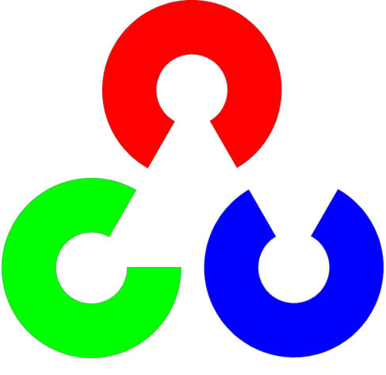

### Salutations! Welcome to my GitHub profile page! ʕ•ᴥ•ʔ

<h4 align="left">Check Out My Website:</h4> 
<a href="https://liamchalk00.github.io/">liamchalk00.github.io</a>

<h4>Social Media:</h4>

<h4 align="left">Coding Languages and Libraries:</h4>

<table>
  <tr>
    <td align="center" width="96">
      
       Verilog
    </td>
    <td align="center" width="96">
      
       Python
    </td>
    <td align="center" width="96">
      
       C++
    </td>
    <td align="center" width="96">
      
       Java
    </td>
    <td align="center" width="96">
      
       HTML
    </td>
    <td align="center" width="96">
      
       OpenCV
    </td>
    <td align="center" width="96">
      
       Matlab
    </td>
    <td align="center" width="96">
      
       Git
    </td>
    <td align="center" width="96">
      
       Django
    </td>
    <td align="center" width="96">
      
       React
    </td>
    <td align="center" width="96">
      
       TCL
    </td>
  </tr>
</table>

  
   
  <small>Public Repository Languages</small>
   
   

<!---

-->

  

